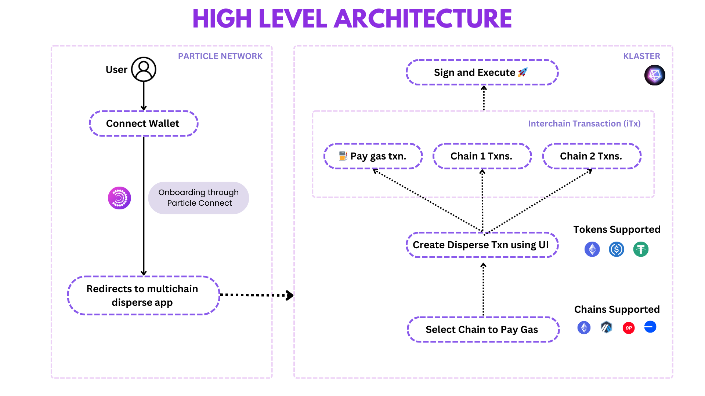
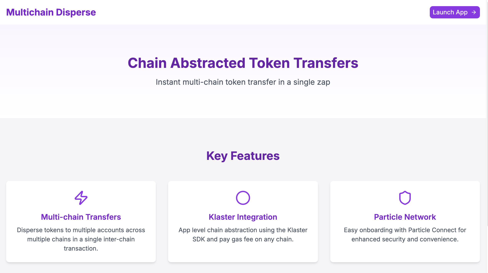
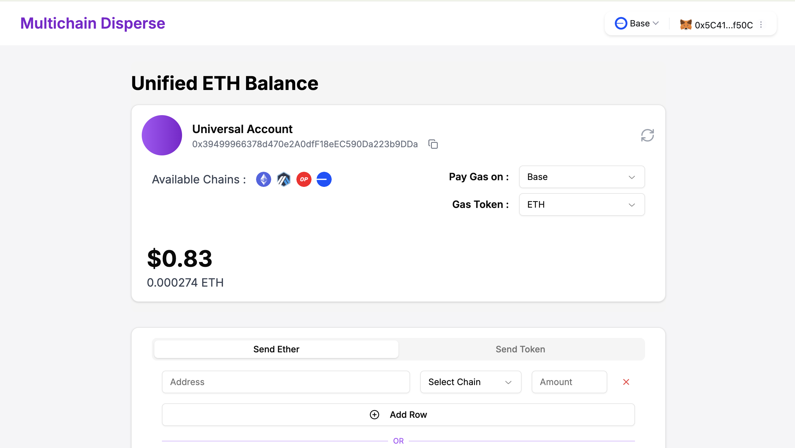
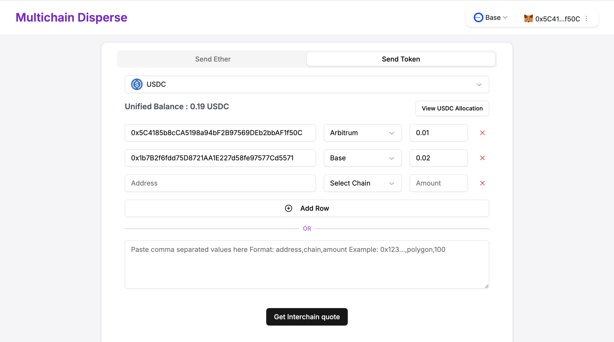
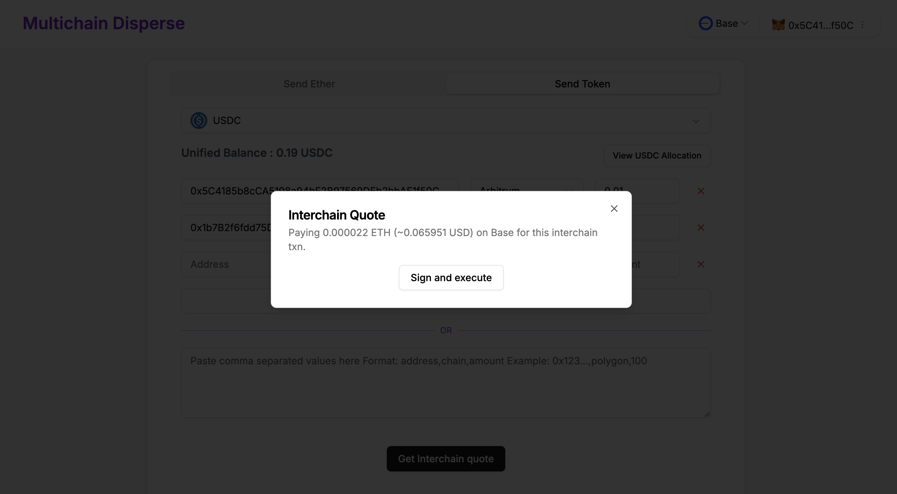
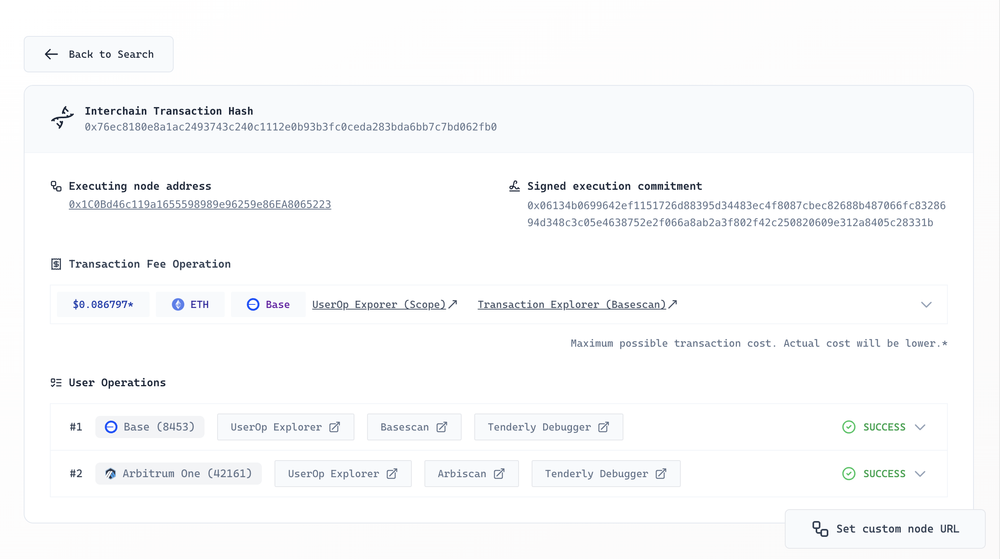

# Multichain Disperse

A chain abstracted disperse app for instant multi chain token transfer in single zap.

### Features

- Easy user onboarding with Particle Connect.
- App level chain abstraction using the Klaster SDK.
- Disperse tokens to multiple accounts across multiple chains in a single inter-chain transaction.
- Pay gas fee on any chain.

## Table of Contents

1. [All Links](#links)
2. [Sponsers Tech Stack](#sponsers-tech-stack)
3. [High Level Architecture](#high-level-architecture)
4. [App Demo](#app-demo-screenshots)
5. [Future Vision](#future-vision)
6. [Instructions to setup and run locally ](#instructions-to-setup)
7. [Team](#team)

## Links

- [Deployed URL](https://multichain-disperse-eight.vercel.app/)
- [Presentation](https://www.canva.com/design/DAGV3KCbqFY/uYzMpf8leZBvRbK_3WJ0bg/view)
- [Demo Video](https://www.youtube.com/watch?v=wr2RlyfXLVY)
- [Example Interchain USDC disperse Txn](https://explorer.klaster.io/details/0x76ec8180e8a1ac2493743c240c1112e0b93b3fc0ceda283bda6bb7c7bd062fb0)

## Sponsers Tech Stack

- Klaster-SDK
- Particle Connect

## High Level Architecture

## App Demo Screenshots

**_Landing Page_**

**_Unified ETH Balance_**

**_Disperse UI_**

**_Sign And Execute Txn_**

**_KLaster Explorer_**

## Future Vision

- Add support for any token to be used for gas payment.
- Add support to disperse any ERC20 token on any chain.
- Gas fee optimization for transfers.

## Instructions to setup

1. Clone the repo `git clone https://github.com/0xAlphadevs/multichain-disperse.git`
2. Install dependencies.
3. Clone `.env.example` and rename it to `.env`.
4. Start the development server.
5. Access the web app in your browser at [http://localhost:3000](http://localhost:3000)

## Team

Team [AlphaDevs](https://www.alphadevs.dev) 👇

### Github

[Harsh Tyagi](https://github.com/mr-harshtyagi)
[Yashasvi Chaudhary](https://github.com/0xyshv)

### Twitter / X

[Harsh Tyagi](https://twitter.com/0xmht)
[Yashasvi Chaudhary](https://twitter.com/0xyshv)

## Thanks

- Feel free to reach out to the [AlphaDevs team](https://www.alphadevs.dev) with any questions or issues.

- We appreciate your interest in our project and welcome contributions and feature suggestions.
